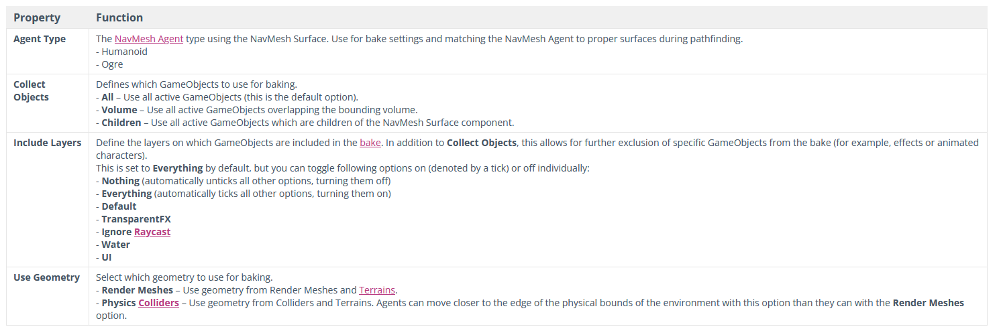
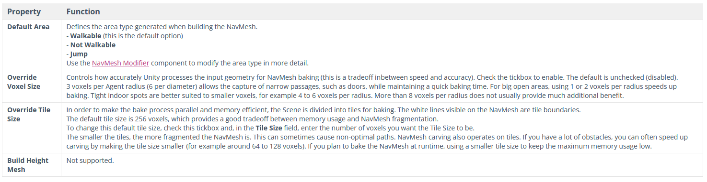

# Nav Mesh

Unde los problemas recurrentes en los juegos relacionados con la Inteligencia Artificial, es el pathfinding o búsqueda de caminos. Por el mismo hecho de ser tan común, Unity nos proporciona una serie de herramientas para utilizar algoritmos de pathfinding.

## Nav Mesh 'avanzado'

Por defecto, Unity no viene con todas las herramientas / scripts que hemos utilizado en clase. Para utilizarlos, tendremos que instalar un paquete que está en fase experimental. Para hacerlo, iremos al Package Manager y en el icono '+' seleccionaremos "Add package by name". A continuaciçon introduciremos `com.unity.ai.navigation`. Una vez hecho, podremos acceder a nuevos componentes como el `NavMeshSurface`, `NavMeshModifierVolume` o `NavMeshLink`.

Para hacer un pathfinding básico nos puede valer con lo que viene instalado por defecto, pero en nuestro caso, queremos tener dos tipos de agentes con diferentes propiedades, que por lo tanto, tendrá mallas distintas.

> Para utilizar los scripts, podemos también simplemente descargarlos desde algún sitio y copiarlos en nuestro proyecto.
> [Nav Mesh Building Components](https://docs.unity3d.com/Manual/NavMesh-BuildingComponents.html)

## Utilizando el Nav Mesh

Para implementar Pathfinding para cualquier objeto, necesitaremos un agente y una malla. El agente
es el objeto que tendrá la capacidad de desplazarse inteligentemente, la malla es la superficie por donde éste se va a poder desplazar.

La malla, aunque la podemos crear en tiempo de ejecución, si siempre es igual, lo más óptimo es hacer un 'bake' (horneado).

Para hacer el bake, crearemos un objeto `NavMeshSurface` o lo que es lo mismo un objeto vacío con el componente `NavMeshSurface`. Desde este objeto, podemos seleccionar el agente para el que queremos crear la malla de navegación. Dependiendo de los parámetros del agente la malla será de una forma u otra. Por ejemplo si hemos puesto a nuestro agente que su 'Max Slope' (Inclinación de rampa que es capaz de subir) es de 20º, por las superficies de nuestra escena en las que el suelo esté a menos de esa inclinación, tendremos malla, y cuando sea mallor no. Por donde tengamos malla, nuestro agente será capaz de desplazarse. Lo mismo con el 'Step Height' (Altura de escalones que es capaz de subir), si nuestro agente es un Humano por ejemplo, en principio podrá subir escalones, por otro lado, si tenemos un Pulpo, a lo mejor no queremos que pueda subir y le pondremos este parámetro a 0.

Las mallas de estos dos tipos de agentes serán diferentes.

> Podemos modificar las características y crear nuevos agentes desde el propio componente `NavMeshSurface` -> Agent Type -> Open Agent Settings o lo que es lo mismo desde la ventana de 'Navigation' que hemos abierto antes -> Agent.

Antes de hace el 'Bake', tenemos que asegurarnos de que haya objetos marcados como 'static', estos son los que utilizará Unity como suelo.

Desde el componente `NavMeshSurface` podemos modificar más parámetros.

> Es recomendable que este objeto esté posicionado en (0, 0, 0).
> Podemos hacer el 'bake' sin utilizar el paquete que hemos instalado desde Window -> AI -> Navigation -> Bake

Una vez tengamos la malla, que la deberíamos de poder ver desde el editor en azul claro, solo nos faltará añadir el componente `NavMeshAgent` al objeto que queremos que implemente el pathfinding. Desde este componente podemos modificar algunos parámetros del Pathfollowing, es decir, la forma en la que el agente va a seguir el camino, velocidad lineal, velocidad de giro, etc.

> En [este vídeo](https://www.youtube.com/watch?v=CHV1ymlw-P8) podemos ver lo básico explicado aquí.

## Resumen componentes

`NavMeshAgent`: Componente que llevará nuestro agente. Desde éste podemos controlar el *Tipo de Agente, su velocidad, aceleración o el modo de esquivar obstáculos.
El Tipo de Agente es el modelo físico del agente, según este la malla por la que se desplaza cambiará. Nuestro agente podría ser un Humanoide o un ogro
por ejemplo, el Ogro quizá poría ser más ancho y más alto por lo que se podrá acercar menos a los obstáculos (Por el hecho de ser más ancho),
pero podrá subir escalones más altos (Por ser más alto).

NavMesh Surface: El componente `NavMeshSurface` nos permite asignar una malla de navegación (NavMesh) a un objecto. Aunque podemos hacer un 'Bake'
en la pestaña 'Navigation', esto nos creará un NavMesh común a todos los 'NavMesh Agents', con lo que no podremos tener diferentes mallas de
navegación para distintos agentes. Si tenemos un "humanoide" y un "ogro", los dos tendrían que compartir la misma malla y si tenemos varios
agentes, probablemente no es eso lo que queramos.

Con NavMesh Surface, podemos guardarnos la malla en un objeto y controlar mejor para qué agente estamos haciendo el 'Bake' entre otras cosas.
Siempre es recomendable usar el NavMesh Surface.

NavMesh Modifier: El componente `NavMeshModifier` es un componente que podemos asignar a cualquier objeto para establecer cómo se tiene que comportar
a la hora de hacer el 'Bake'. Podemos definir un área (Walkable, No Walkable, etc...) o hacer que el 'Bake' no lo tenga en cuenta.

NavMesh Modifier Volume: Este componente es parecido al `NavMeshModifier`. La diferencia clave es que el primero, nos permite marcar un objeto, mientras
que este, nos permite marcar un volumen. Esto nos puede venir bien si el área que queremos establecer como "Dangerous" por ejemplo, no está delineada
por los objetos de nuestra escena.

NavMesh Link: Este componente nos permite enlazar dos NavMesh diferentes.