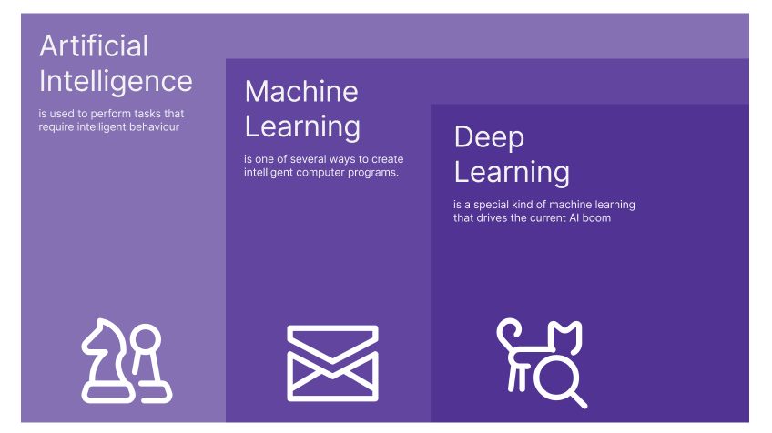
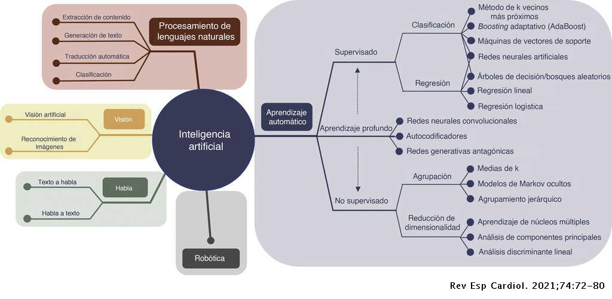
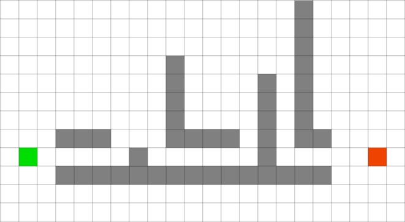
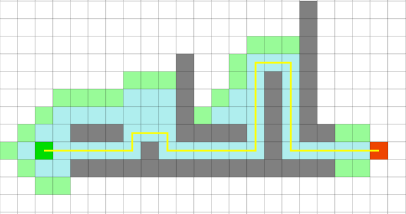
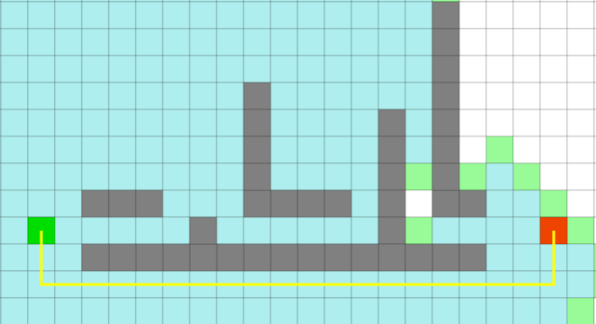

# Introducción a la Inteligencia Artificial

## Historia y Evolución

> La inteligencia artificial y los videojuegos han ido históricamente muy de la mano. Los juegos son un entorno perfecto no solo para pequeñas IAs que controlan enemigos sino también para entender y entrenar grandes proyectos de machine learning. Hay infinidad de ejemplos, algunos de los más conocidos son [Alpha Go](https://es.wikipedia.org/wiki/AlphaGo), [Alpha Zero](https://es.wikipedia.org/wiki/AlphaZero) o [OpenAI Five](https://openai.com/five/).

## Modelos de IA

Llamamos **I**nteligencia **A**rtificial o **IA** a cualquier programa informático que simula comportamientos inteligentes. Es importante no confundir Inteligencia Arificial con otros conceptos como **Machine Learning** o **Deep Learning**. A lo largo del tema veremos las diferencias, ahora nos centraremos en el concepto de IA.

Como acabamos de definir, una IA es un programa informático que **simula** comportamiento inteligente, esto quiere decir que no tiene por qué "ser inteligente", puede ser un programa sencillo que sigue unas pocas reglas. Veamos un ejemplo:

Imaginemos un juego de disparos por ejemplo y pongamos que nuestra IA controla a los enemigos. Estos tienen cien puntos de vida. Una estrategia a seguir podría ser este conjunto de reglas.

1. Si tenemos < 10 puntos de vida: ESCONDERSE
2. Si vemos al jugador: DISPARAR
3. BUSCAR AL JUGADOR

Con estas 3 reglas ya tenemos un comportamiento inteligente. Pongamos que tenemos **80 puntos de vida y NO vemos al jugador**. El algoritmo se ejecutaría tal que:

* Tenemos más de 10 puntos de vida, por tanto no se cumple la regla 1, pasamos a la 2.
* No vemos al jugador, pasamos a la 3
* La 3 no tiene condición, simplemente buscamos al jugador.

Otro caso podría ser, **tenemos 7 puntos de vida y SÍ vemos al jugador**.

* Se cumple la condición 1, nos escondemos.

Así de simple. Este comportamiento es muy sencillo de programar, como vemos la IA no es inteligente, simplemente sigue unas reglas y no aprende de sus errores. El jugador puede predecir fácilmente qué va a hacer el enemigo. Aun así, esto es un Inteligencia Artificial ya que simula un comportamiento inteligente.

Aunque en el ejemplo que hemos visto es muy fácil de predecir el comportamiento resultante, las reglas pueden aumentar y complicarse si tenemos más parámetros como por ejemplo la vida del jugador, la distancia que nos separa de él, el tipo de arma que llevamos, etc...

Con esto, queremos explicar que esta técnica, aunque es muy básica puede dar muy buenos resultados y nos puede servir en muchos casos, todo dependerá de qué necesitemos de la IA. Además, podemos hacer que algunas decisiones sean aleatorias para hacer más impredecible nuestro comportamiento. Por ejemplo si tenemos poca vida pero el jugador también, podemos tomar la decisión de escondernos o disparar, esta decisión podría ser aleatoria.

Ahora que ya sabemos la definición de IA, podemos empezar a distinguir entre otros dos conceptos, **Machine Learning** y **Deep Learning**. Veremos primero el Machine Learning.

Como su nombre indica, **con machine learning, nos referimos a todas aquellas técnicas que se basan en que los programas aprendan**. Ahora ya no basta con definir unas reglas y seguirlas, el programa, va a ir ganando conocimientos para perfeccionar su comportamiento, que en general, será el de resolver alguna tarea en específico.

Un problema comunmente abordado con estas técnicas es la clasificación de imágenes.
El objetivo no es otro que el de etiquetar imágenes.

> Utilizamos estas técnicas para resolver estos problemas porque no se puede hacer con programación 'convencional', necesitamos crear modelos de los que emergen comportamientos inteligentes.

> A partir de ahora llamaremos **ML** al **M**achine **L**earning.

Antes de entrar más en detalle, hemos de saber que el mundo de la Inteligencia Artificial es muy ámplio y complejo, esto significa que no vamos a ver ni mucho menos todo lo que existe ni tampoco entraremos demasiado en detalle en las técnicas.

Para hacernos una idea, aquí tenemos un esquema que clasifica diferentes técnicas de IA. Como vemos, podemos dividir las técnicas de ML (aprendizaje automático) en subgrupos, nosotros solo distinguiremos entre Aprendizaje Supervisado y No Supervisado.

### Tipos de Algoritmos de ML

Simplificando un poco podemos clasificar los algoritmos de ML en 2 **Tipos**, el **Aprendizaje Supervisado** y el **Aprendizaje No Supervisado**.

Entender las diferencias es sencillo, los algoritmos de **Aprendizaje Supervisado** utilizan información preprocesada para entrenarse.

Por otro lado, los algoritmos de **Aprendizaje No Supervisado** NO utilizan información preprocesada.

Volviendo al problema de antes, un algoritmo de aprendizaje supervisado, utilizaría imágenes etiquetadas por personas para entrenarse. Esto es información preprocesada ya que personas han tenido que etiquetar antes las imágenes. Una vez entrenado, el programa intentaría predecir otras imágenes no etiquetadas.

Si utilizamos una técnica de aprendizaje NO supervisado, significa que para el entrenamiento del modelo [*](#anexo), no hemos utilizado esta 'ventaja' de etiquetar imágenes previamente.

> Lo ideal es que los datos estuviesen preprocesados, pero la realidad es que para muchos problemas eso no es viable.

> Existen otros tipos como el **Aprendizaje por Refuerzo** o el **Aprendizaje Semisupervisado**.

### Técnicas de ML

Hay varias técnicas que podemos utilizar para que nuestro programa aprenda, dependiendo del problema que queramos resolver, unas nos darán mejores resultados que otras.

> No vamos a verlas todas aunque podemos encontrar más información [aquí](https://es.wikipedia.org/wiki/Aprendizaje_autom%C3%A1tico).

Las que más nos interesan son los **Árboles de Comportamieto**, los **Algoritmos Genéticos** y las **Redes Neuronales**. Siendo esta última la técnica más popular. No vamos a entrar demasiado en cómo funcionan porque son realmente complejas.

#### Redes Neuronales

Una **Red Neuronal Artificial** es una imitación informática del funcionamiento del cerebro humano. Esta, consiste en un conjunto de neuronas conectadas entre sí. Las neuronas se suelen agrupar en capas. El objetivo es ir poco a poco afinando algunos valores que contiene cada neurona para que 'aprenda' a resolver nuestro problema.

#### Algoritmos Genéticos

Un **Algoritmo Genético** es un programa que, basándose en la evolución biológica, crea una población de indivíduos y los modifica de forma semialeatoria generación tras generación. Cada entidad de esta población es una posible solución a nuestro problema. A base de repeticiones, se van mutando y cruzando estas posibles soluciones consiguiendo mejores resultados.

#### Árboles de Comportamiento

Un **Árbol de Comportamiento** es un árbol definido que nos ayuda a tomar decisiones dependiendo de ciertas variables.

> Los veremos con más profundidad en el tema 4.

## Pathfinding

Como jugadores o usuarios de cualquier aplicación, hay algunas características en el funcionamiento de los programas, que si no lo pensamos, como son muchos los sitios en los que está implementada, damos por hecho que son cosas sencillas de hacer. En el caso de los juegos, estamos muy acostumbrados a que los enemigos o nuestro propio personaje sepan el camino que tienen que seguir sin chocar con ningún obstáculo. Esto es algo muy habitual que nos puede tocar implemetar en algún juego, es por eso mismo que esta técnica de Inteligencia Artificial sí que la vamos a ver más en detalle. 

Un algoritmo de **Pathfinding** es un algoritmo que tiene como objetivo encontrar un camino entre dos puntos. Hay muchos algoritmos que pueden funcionar mejor o peor en diferentes escenarios. Aunque lo ideal es encontrar el camino más corto, en los videojuegos es muy importante la rapidez de procesamiento. Esto hace que a lo largo de los años se hayan ido perfeccionando este tipo de algoritmos pero además, hace que en ciertos casos, la ruta que encontramos no sea la más corta.

El algoritmo de Pathfinding más utilizado en los videojuegos es el [A*](https://es.wikipedia.org/wiki/Algoritmo_de_b%C3%BAsqueda_A*) y podemos encontrarlo ya implementado. Esto es debido a que nos aporta muchas ventajas. Es rápido, suele encontrar el camino óptimo y es fácilmente 'personaizable'. Además, funciona muy bien en los escenarios de videojuegos.

Por otro lado, tenemos el algoritmo de dijkstra o el de búsqueda en anchura, estos dos, siempre encuentran el camino óptimo pero son menos eficientes. A continuación podemos ver un ejemplo.

Para un mismo escenario, utilizando dos algoritmo diferentes, observamos dos resultados diferentes.

En el primer caso, vemos que A* comprueba pocas casillas pero no consigue encontrar el camino más corto.

En el segundo, con dijkstra sí que encontramos el camino más corto pero a costa de comprobar muchas más casillas.

> Las casillas en azúl son las que hemos comprobado.

<table align="center">

<tr>
<th>A*</th>
<th>Dijkstra</th>
</tr>

<tr>
<td></td>
<td></td>
</tr>

</table>

> Los algoritmos de dijkstra y de búsqueda en anchura no son algoritmos pensados para nuestros casos de uso, pero son más fáciles de entender y programar. El algoritmo A* es especialmente bueno y por lo general no usaremos ningún otro. Podemos variar su comportamiento cambiando la heurística y de hecho para que 'fallara' en este caso, hemos tenido que hacer 'trampa' y hemos ajustado el 'weight' a 2. A parte de estos, hay otros algoritmos basante 'mejores' que se acercan a la eficacia de A*.

> En [este](https://qiao.github.io/PathFinding.js/visual/) enlace podeis probar diferentes algoritmos, es interesante ver cómo funcionan y intentar buscar qué debilidades y ventajas tiene cada uno.

## Anexo

* Modelo: Cuando hablamos de modelo, nos referimos al programa inteligente.