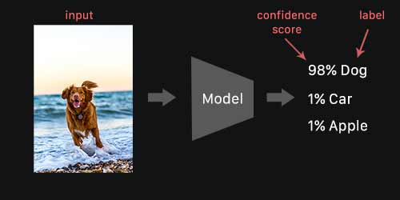
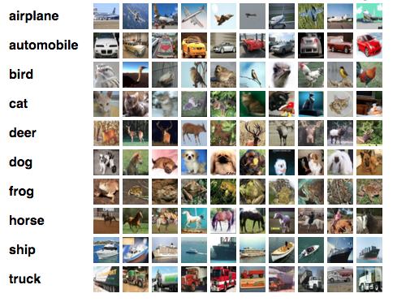
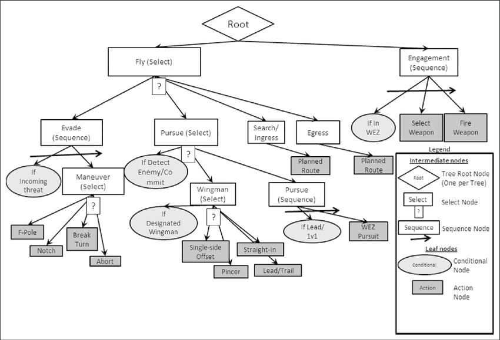

# Introducción a la Inteligencia Artificial

## Historia y Evolución

## Modelos de IA

Llamamos **I**nteligencia **A**rtificial o **IA** a cualquier programa informático que simula comportamientos inteligentes. Es importante no confundir Inteligencia Arificial con otros conceptos como **Machine Learning** o **Deep Learning**. A lo largo del tema veremos las diferencias, ahora nos centraremos en el concepto de IA.

Como acabamos de definir, una IA es un programa informático que **simula** comportamiento inteligente, esto quiere decir que no tiene por qué "ser inteligente", puede ser un programa sencillo que sigue unas pocas reglas. Veamos un ejemplo:

Imaginemos un juego de disparos por ejemplo y pongamos que nuestra IA controla a los enemigos. Estos tienen cien puntos de vida. Una estrategia a seguir pofría este conjunto de reglas.

1. Si tenemos < 10 puntos de vida: ESCONDERSE
2. Si vemos al jugador: DISPARAR
3. BUSCAR AL JUGADOR

Con estas 3 reglas ya tenemos un comportamiento inteligente. Pongamos que tenemos **80 puntos de vida y NO vemos al jugador**. El algoritmo se ejecutaría tal que:

* Tenemos más de 10 puntos de vida, por tanto no se cumple la regla 1, pasamos a la 2.
* No vemos al jugador, pasamos a la 3
* La 3 no tiene condición, simplemente buscamos al jugador.

Otro caso podría ser, **tenemos 7 puntos de vida y SÍ vemos al jugador**.

* Se cumple la condición 1, nos escondemos.

Así de simple. Este comportamiento es muy sencillo de programar, como vemos la IA no es inteligente, simplemente sigue unas reglas y no aprende de sus errores. El jugador puede predecir fácilmente qué va a hacer el enemigo. Aun así, esto es un Inteligencia Artificial ya que simula un comportamiento inteligente.

Aunque en el ejemplo que hemos visto es muy fácil de predecir el comportamiento resultante, las reglas pueden aumentar y complicarse si tenemos más parámetros como por ejemplo la vida del jugador, la distancia que nos separa de él, el tipo de arma que llevamos, etc...

Con esto, queremos explicar que esta técnica, aunque es muy básica puede dar muy buenos resultados, y nos puede servir en muchos casos, todo dependerá de qué necesitemos de la IA. Además, podemos hacer que algunas decisiones sean aleatorias para hacer más impredecible nuestro comportamiento. Por ejemplo si tenemos poca vida pero el jugador también podemos tomar la decisión de escondernos o disparar, esta decisión podría ser aleatoria.

Ahora que ya sabemos la definición de IA, podemos empezar a distinguir entre otros dos conceptos, **Machine Learning** y **Deep Learning**. Veremos primero el Machine Learning.

Como su nombre indica, **con machine learning, nos referimos a todas aquellas técnicas que se basan en que los programas aprendan**. Ahora ya no basta con definir unas reglas y seguirlas, el programa, va a ir ganando conocimientos para perfeccionar su comportamiento, que en general, será el de resolver alguna tarea en específico.

Un problema comunmente abordado con estas técnicas es la clasificación de imágenes.
El objetivo no es otro que el de etiquetar imágenes.

> Utilizamos estas técnicas para resolver estos problemas porque no se puede hacer con programación 'convencional', necesitamos crear modelos de los que emergen comportamientos inteligentes.

> A partir de ahora llamaremos **ML** al **M**achine **L**earning.

Antes de abordar el problema, tenemos que seguir definiendo cosas. Hemos de diferenciar entre la **Técnica de ML** que utilizamos y el **Tipo** de esa técnica.

Simplificando un poco podemos clasificar los algoritmos de ML en 2 **Tipos**, el **Aprendizaje Supervisado** y el **Aprendizaje No Supervisado**.

Entender las diferencias es sencillo, los algoritmos de **Aprendizaje Supervisado** utilizan información preprocesada para entrenarse.

Por otro lado, los algoritmos de **Aprendizaje No Supervisado** NO utilizan información preprocesada.

Volviendo al problema de antes, un algoritmo de aprendizaje supervisado, utilizaría imágenes etiquetadas por personas para entrenarse. Esto es información preprocesada ya que personas han tenido que etiquetar antes las imágenes.

Si utilizamos una técnica de aprendizaje NO supervisado, significa que para el entrenamiento del modelo [*](#anexo), no hemos utilizado esta 'ventaja' de etiquetar imágenes previamente.

> Lo ideal es que los datos estuviesen preprocesados, pero la realidad es que para muchos problemas eso no es viable.

> Existen otros tipos como el **Aprendizaje por Refuerzo** o el **Aprendizaje Semisupervisado**.

## Pathfinding

## Behaviour Trees (Árboles de comportamiento)

Aunque no es exactamente igual, esta que hemos visto antes es un poco la idea de los **Behaviour Trees**. Son muy sencillos de entender, tenemos 3 tipos de nodos:

* Nodo secuencia: Ejecuta las acciones de izquierda a derecha.
* Nodo acción: Es una acción que podemos hacer.
* Nodo selector: dependiendo de una regla o de forma aleatoria elije uno de sus nodos hijos para ejecutarlo.

Veamos un ejemplo con el sigiuente árbol:

Los posibles caminos que podrían darse son:

1. Walk to Door -> Open Door -> Walk throught Door -> Close Door.
2. Walk to Door -> Unlock Door -> Open Door -> Walk throught Door -> Close Door.
3. Walk to Door -> Smash Door -> Walk throught Door -> Close Door.

Veámoslo con un poco más de detalle por si no lo hemos entendido, vamos a seguir el camino 2.

El primer nodo es nodo raíz, en este caso está arriba del todo, es un nodo secuencia por lo que pasaremos por sus nodos hijos de izquierda a derecha.
El primer nodo es 'Walk to Door', como es nodo acción, simplemente ejecutaríamos esta acción.
El segundo nodo es un selector, elejiremos en este caso de forma aleatoria uno de sus hijos. Nosotros nos quedamos con el de el medio (Secuence).

Secuence es otro nodo secuencia, de nuevo, ejecutaremos las acciones de izquierda a derecha, en este caso 'Unlock Door' y 'Open Door'.

Hemos acabado con nuestro nodo selector pero que no se nos olvide, aún tenemos acciones pendientes del selector previo. Ya hemos pasado por las 2 primeras, ahora nos quedan las dos siguientes. En este caso son también nodos acción con lo que simplemente los ejecutaremos. 'Walk throught Door' y 'Close Door'.

Ahora sí, hemos acabado.

> Un nodo hoja es un nodo que no tiene hijos. Los nodos acción SIEMPRE son nodos hoja y viceversa (las hojas SIEMPRE son nodos acción).
>
> Los nodos Secuencia y Selector NO pueden ser nodos hoja.

Como hemos visto antes, estos árboles se pueden complicar mucho, aquí un ejemplo de uno un poco más grande. (No hace falta enetender el comportamiento de este).

> En el caso de este árbol, vemos que distingue entre nodos 'Select' y 'Conditional', estos no son más que nodos Selectores, unos son aleatorios y otros dependen de una condición.

> La inteligencia artificial y los videojuegos han ido históricamente muy de la mano. Los juegos son un entorno perfecto no solo para pequeñas IAs que controlan enemigos sino también para entender y entrenar grandes proyectos de machine learning. Hay infinidad de ejemplos, algunos de los más conocidos son [Alpha Go](https://es.wikipedia.org/wiki/AlphaGo), [Alpha Zero](https://es.wikipedia.org/wiki/AlphaZero) o [OpenAI Five](https://openai.com/five/).

## Anexo

* Modelo: Cuando hablamos de modelo, nos referimos al programa inteligente.