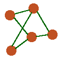
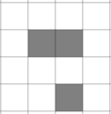
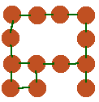
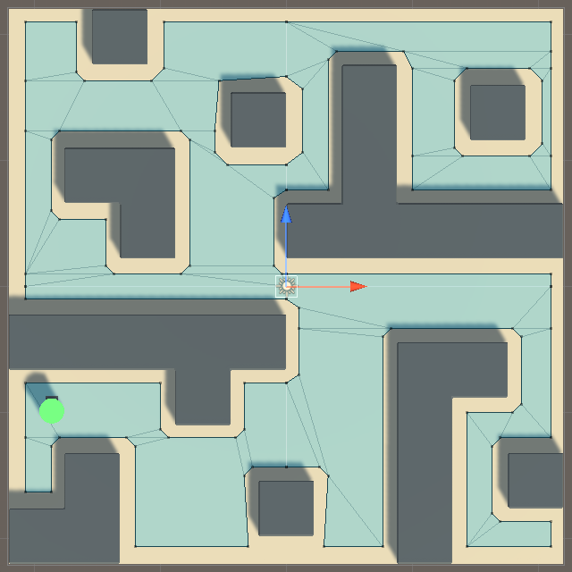

# Sistemas de Navegación Automática

En este tema vamos a ver cómo implementar pathfinding en Unity. Obviamente, podemos implementarlo nosotros mismos desde cero, pero los motores de videojuegos existen por algo, Unity ha desarrollado los componentes NavMesh (Navigation Meshes), con estos es mucho más fácil, rápido y generalizado hacer funcionar nuestro sistema.

Antes de nada, vamos a aclarar un par de cosas ya que aunque ya vimos el algoritmo A*, lo visualizamos funcionando en cuadrículas y puede que no entendamos cómo puede esto funcionar en un juego como el League of Legends por ejemplo.
Una solución es superponer una cuadrícula por toda la escena y marcar las casillas en las que haya obstáculos y las que no. Si tuviésemos que implementarlo nosotros y necesitamos acabarlo rápido, podemos hacerlo así, pero esta solución ni es eficiente, ni se va a ver bien.

Veamos cómo hacerlo bien. Realmente aunque para visualizarlo es más fácil con casillas, los algoritmos de pathfinding bien implementados trabajan con grafos. Un grafo es un conjunto de nodos conectados entre si.

Para representar nuestro escenario con grafos, conectaremos cada nodo con todos aquellos nodos a los que podamos acceder. Para este pequeño escenario nos quedaría el siguiente grafo.

<table align="center">

<tr>
<th>Formato cuadrícula</th>
<th>Formato Grafo</th>
</tr>

<tr>
<td></td>
<td></td>
</tr>

</table>

De este modo, si nuestro agente [*](#anexo) se encuentra en un nodo, podrá desplazarse a todos los nodos que tengan una conexión, independientemente de lo lejos o cerca que veamos los nodos a nivel visual. Los grafos NO representan espacialmente nuestra escena.

## Unity Navigation Meshes (NavMesh)

Lo primero que hace Unity, es crear una malla (mesh) de los sitios por los que nuestro agente puede pasar. Esto, en general, lo haremos antes de ejecutar el juego siempre que los muros u obstáculos no se muevan y por ende esta malla vaya a ser siempre la misma.

Dividiremos la malla en **polígonos convexos**, estos tienen la propiedad de que desde cualquier punto del polígono podemos ir a cualquier otro punto del mismo en línea recta.

Ahora, ya podemos representar nuestra escena en forma de grafo, cada polígono será un nodo y estará conectado a sus polígonos adyacentes. Podemos ejecutar el algoritmo de pathfinding con este grafo y obtendremos los polígonos por los que nuestro agente tiene que pasar para llegar a su destino.

Para desplazarse dentro de un polígono, como hemos visto, lo podemos hacer en línea recta, sabiendo esto solo nos quedará implementar el **Pathfollowing**, que no es más que la forma en la que nuestro agente sigue el camino. El componente 'Nav Mesh Agent' implementa esto. Veremos más detalles en clase.

## Obstáculos estáticos y Dinámicos

Como hemos dicho antes, existen obstáculos estáticos y dinámicos. Es mucho más eficiente que nuestro escenario sea estático, de esta forma podemos generar una estructura como la que hemos visto antes y utilizarla en tiempo de ejecución sin que esta cambie.

> Podemos marcar como 'static' cualquier objeto en Unity.

Para los obstáculos dinámicos es un poco más complicado. En Unity tenemos dos formas de abordarlos. Una de ellas, es volver a generar nuestra malla y grafo cada cierto tiempo. Podemos hacerlo cada frame o cada medio segundo por ejemplo.Obviamente, cuanto mayor sea este tiempo, más imprecisiones veremos pero menos recursos [*](#anexo) necesitaremos y cuando menor sea, veremos resultados más exactos pero necesitaremos más recursos.

Generar toda esta estructura es realmente costoso por lo que no es recomendable ni mucho menos rehacer esto cada frame o cada poco tiempo.

La otra forma que existe en Unity, no regenera la malla sino que tiene en cuenta algunos parámetros como la velocidad de los obstáculos para tratar de esquivarlos. Con esta técnica pueden suceder colisiones. En la práctica veremos las diferencias, en concreto en la escena **B_dynamic_obstacles**.

Para más información sobre cómo funciona Unity a nivel interno, podemos consultar en la documentación oficial, [Inner Workings of the Navigation System](https://docs.unity3d.com/Manual/nav-InnerWorkings.html).

## Práctica

### Materiales

* Proyecto sobre el que vamos a trabajar: https://github.com/videojuegos-abastos/nav-mesh-project
* Podemos descargarlo también desde el Aula Virtual

* La solución se hará pública para los alumnos más tarde (branch: complete): https://github.com/videojuegos-abastos/nav-mesh-complete/tree/complete

> La práctica está basada en el tutorial oficial de Unity con lo que si no se ha asistido a clase, podemos aprender desde la propia [lección](https://learn.unity.com/tutorial/working-with-navmesh-agents). Además, hay una serie de tres vídeos que recomendados también para quien no haya asistido o para finalizar la práctica y familiarizarse con los NavMesh en casa. Vídeos [I](https://www.youtube.com/watch?v=CHV1ymlw-P8), [II](https://www.youtube.com/watch?v=FkLJ45Pt-mY) y [III](https://www.youtube.com/watch?v=blPglabGueM).

> Aunque se puede descargar el proyecto oficial de Unity, es recomendable descargar el nuestro, ya que está adaptado a los conocimientos que tenemos y enfocado en el temario.

## Anexo

* Agente: llamamos agente al objeto controlado por la IA.
* Recursos: nos referimos a recursos computacionales, a la capacidad de procesamiento del dispositivo.