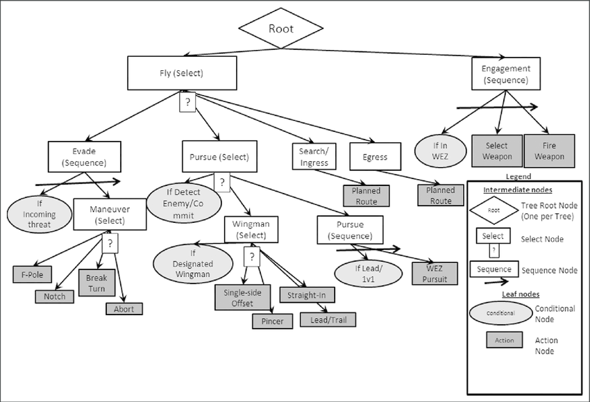

## Behaviour Trees (Árboles de comportamiento / decisión)

Los **Behaviour Trees**, son una técnica muy utilizanda en inteligencia artificial. Son muy sencillos de entender, tenemos un árbol jerárquico con 3 tipos de nodos:

* Nodo secuencia: Ejecuta las acciones de izquierda a derecha.
* Nodo acción: Es una acción que podemos hacer.
* Nodo selector: dependiendo de una regla o de forma aleatoria elije uno de sus nodos hijos para ejecutarlo.

Veamos un ejemplo con el sigiuente árbol:

Los posibles caminos que podrían darse son:

1. Walk to Door -> Open Door -> Walk throught Door -> Close Door.
2. Walk to Door -> Unlock Door -> Open Door -> Walk throught Door -> Close Door.
3. Walk to Door -> Smash Door -> Walk throught Door -> Close Door.

Veámoslo con un poco más de detalle por si no lo hemos entendido, vamos a seguir el camino 2.

El primer nodo es nodo raíz, en este caso está arriba del todo, es un nodo secuencia por lo que pasaremos por sus nodos hijos de izquierda a derecha.
El primer nodo es 'Walk to Door', como es nodo acción, simplemente ejecutaríamos esta acción.
El segundo nodo es un selector, elejiremos en este caso de forma aleatoria uno de sus hijos. Nosotros nos quedamos con el de el medio (Secuence).

Secuence es otro nodo secuencia, de nuevo, ejecutaremos las acciones de izquierda a derecha, en este caso 'Unlock Door' y 'Open Door'.

Hemos acabado con nuestro nodo selector pero que no se nos olvide, aún tenemos acciones pendientes del selector previo. Ya hemos pasado por las 2 primeras, ahora nos quedan las dos siguientes. En este caso son también nodos acción con lo que simplemente los ejecutaremos. 'Walk throught Door' y 'Close Door'.

Ahora sí, hemos acabado.

> Un nodo hoja es un nodo que no tiene hijos. Los nodos acción SIEMPRE son nodos hoja y viceversa (las hojas SIEMPRE son nodos acción).
>
> Los nodos Secuencia y Selector NO pueden ser nodos hoja.

Como hemos visto antes, estos árboles se pueden complicar mucho, aquí un ejemplo de uno un poco más grande. (No hace falta enetender el comportamiento de éste).

> En el caso de este árbol, vemos que distingue entre nodos 'Select' y 'Conditional', estos no son más que nodos Selectores, unos son aleatorios y otros dependen de una condición.

Con lo que hemos visto, tenemos una estrategia para tomar decisiones. Nuestra IA, utilizará el árbol para decidir qué hacer. Ahora viene la parte interesante, lo que hemos visto hasta ahora no tiene nada de Machine Learning. La idea es que no seamos nosotros quienes tengamos que generar el árbol, sino que se genere automáticamente a partir de datos.

Existen diferentes algoritmos que generarán el árbol. Dependiendo del algoritmo que utilicemos podemos acabar con árboles distintos. Uno de los algoritmos más simpes es [ID3](https://es.wikipedia.org/wiki/Algoritmo_ID3) aunque existen otros como [Find-S](https://es.wikipedia.org/wiki/Algoritmo_find-s) o el [Algoritmo de Cobertura](https://es.wikipedia.org/wiki/Algoritmo_de_cobertura).

En la imagen de abajo, podemos ver un ejemplo de cómo podrían ser los datos y de nuestro árbol resultante. En este caso, nuestra IA tiene que decidir si salimos a jugar al golf o no basándose en diferentes indicadores como la temperatura, la humedad, el viento o la apariencia del clima (outlook).

Aunque no vamos a ver en detalle ningún algoritmo, sí que es interesante saber cómo funciona ID3 ya que su implementación es sencilla. Éste, utiliza una fórmula para determinar la entropía de las variables y contruye el arbol desde el nodo raíz hasta sus hojas. Partiendo del nodo raíz, lo que hace es determinar qué variable discierne más el output y crea un nodo que divide el árbol dependiendo de esta varaible.

# Práctica

Al igual que las máquinas de estado, los árboles de comportamiento proporcionan a los diseñadores una forma simple de crear inteligencia. Para la práctica, en vez de programar lo que hemos visto, utilizaremos un paquete gratuito que nos facilita mucho las cosas.
El paquete ha sido desarrollado por The Kiwi Coder.

Enlace al paquete: https://thekiwicoder.com/behaviour-tree-editor/
Introducción al paquete: https://www.youtube.com/watch?v=SgrG6uAZDHE

> Para importar el paquete: Assets -> Import Package -> Custom Package