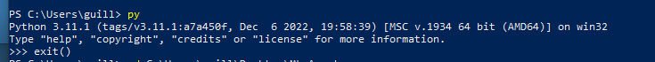
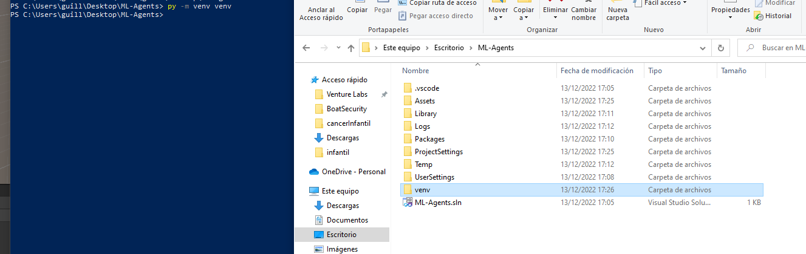

# Unity ML-Agents

Unity [ML-Agents](https://unity.com/products/machine-learning-agents) es una herramienta oficial de Unity con la que podremos entrenar nuestros propios modelos de Machine Learning. En concreto, se utilizan [Redes Neuronales](), con lo que ahora sí, estamos hablando de Deep Learning o Aprendizaje Profundo.

Utilizar ML-Agents no es tan simple como instalar un paquete, para entrenar a los modelos, se utiliza [Python](https://www.python.org/) con lo que tendremos que instalar algunas cosas para poder empezar.

Python es un lenguaje de programación de alto nivel muy utilizando para machine learning ya que existen gran cantidad de librerias y módulos que facilitan la implementación. Algunos de estos módulos los vamos a instalar a continuación de hecho.

Toda la documentación oficial la podemos encontrar [aquí](https://github.com/Unity-Technologies/ml-agents/tree/develop/docs). En este documento intentaremos resumir todo lo que hay que hacer para que no haya pérdida.

> El código es Open Source, podemos encontrarlo [aquí](https://github.com/Unity-Technologies/ml-agents).

> En [este vídeo](https://www.youtube.com/watch?v=zPFU30tbyKs) podemos seguir en casa todos los pasos también aunque es del 2018 y algunas cosas sobre todo con respecto a la instalación no son exactamente iguales auque la mayoría se mencionan en el propio vídeo. Algo que no se menciona es que la versión de PyTorch que instala solo es compatible con Python 3.7, 3.8 y [3.9](https://www.python.org/downloads/release/python-3913/). A parte de esto, hay algunas cosas interesantes que no están en esta guía, si queremos aprender más, podemos ver este vídeo o muchos otros que hay.
Aunque el vídeo sea de CodeMonkey, es el recomendado desde Unity.


## Pasos a seguir para utilizar ML-Agents.

### Instalación de Python y módulos necesarios.

Lo primero que hemos de hacer es instalar Python. A día de hoy la última versión es la 3.11.1 pero **nosotros queremos la 3.9** ya que utilizaremos unas librerías con versiones concretas para que todo funcione correctamente.

Dejaremos las opciones por defecto para no complicar el proceso aunque podemos ahorrarnos instalar algunas cosas como el IDE o la documentación.

[Descargar Python 3.9](https://www.python.org/downloads/release/python-3913/).

[Otras versiones](https://www.python.org/downloads/).

Para comprobar que se ha instalado correctamente podemos ejecutar el comando `py` en la consola. Debería cambiar a la consola de python, podemos escribir `exit()` para salir.

<p align="center">

</p>

A continuación vamos a crear un entorno virtual para poder tener diferentes proyectos y que los módulos y versiones no interfieran entre sí:

1. Desde la terminal, nos colocamos en el directorio del proyecto utilizando el comando `cd`.

<p align="center">

</p>

2. Crearemos nuestro entorno virtual con `py -m venv venv`.

<p align="center">

</p>

> El parámetro '-m' nos indica que vamos a correr un módulo de python, en este caso el venv. El segundo venv del comando es el nombre que le vamos a dar a nustro entorno, podemos escojer otro si queremos.

3. Entramos a nuestro entorno virtual `venv\Scripts\activate`.
4. Actualizamos el paquete pip por si acaso aunque debería de estar actualizado. `python -m pip install --upgrade pip`

> A continuación instalaremos los paquetes que necesita ml-agents para funcionar

5. PyTorch: `pip3 install torch~=1.7.1 -f https://download.pytorch.org/whl/torch_stable.html`

> La versión de pytorch puede cambiar, podemos consultarla en la [documentación oficial](https://github.com/Unity-Technologies/ml-agents/blob/develop/docs/Installation.md).

6. ML-Agents: `python -m pip install mlagents==0.30.0`

### Comandos de instalación

Aunque los comandos sean iguales, las rutas habrá que adaptarlas.
```bash
C:\Users\guill> cd C:\Users\guill\Desktop\ML-Agents # Entramos en la carpeta de nuestro proyecto

C:\Users\guill\Desktop\ML-Agents> py -m venv venv # Creamos el entorno virtual en la carpeta de nuestro proyecto

C:\Users\guill\Desktop\ML-Agents> venv\Scripts\activate # Entramos en el entorno virtual

(venv) PS C:\Users\guill\Desktop\ML-Agents> python -m pip install --upgrade pip # Actualizamos pip por si acaso

(venv) PS C:\Users\guill\Desktop\ML-Agents> pip3 install torch~=1.7.1 -f https://download.pytorch.org/whl/torch_stable.html # Instalamos PyTorch CUDA opcional

(venv) PS C:\Users\guill\Desktop\ML-Agents> python -m pip install mlagents==0.30.0
```

### Importamos el paquete ML-Agents en Unity

Desde el Package Manager de Unity buscaremos el paquete ML-Agents y lo importaremos.

Para comprobar que se ha importado correctamente, podemos probar a añadir un componente a un objeto. Debería salirnos un contenedor ML-Agents. Podemos buscar los compenentes Agent, Behabiour Parameters o Decision Requester por ejemplo.

### Preparar escenario

Una vez tenemos todo configurado, podemos emprezar con la creación de nuestro escenario. Para entrenar a nuestro modelo, tendremos por una parte el agente y por otra el escenario. El agente tendrá que aprender a superar algún tipo de reto. Para este ejemplo, el reto será esquivar un obstáculo moviéndose a lo largo del 'eje x'.

Para esta parte, abriremos el proyecto ML-Agents para ver mejor qué componentes utilizaremos, cómo hemos de hacer el código y cómo entrenar a nuestro agente.

El proyecto podemos encontrarlo en el Aula Virtual, podemos utilizar github también para tener la [última versión](https://github.com/videojuegos-abastos/ml-agents).


### Comandos de entrenamiento

Eston son los comandos que podemos necesitar para entrenar a nuestro modelo, como vemos realmente son los mismos y simplemente le pasamos diferentes opciones. El comando básico es `mlagents-learn`, éste inicia el entrenamiento del modelo. Si lo ejecutamos una vez todo irá bien pero a la segunda, como ya se habrá guardado un modelo, nos dirá que no lo va sobreescribir. Para sobreescribirlo, utilizarems la opción `--force`. Para crear otro modelo con un ID difernete utilizaremos la opción `--run-id=nombre_de_nuestro_nuevo_modelo`.

Para entrenar a nustro modelo, primero correremos el comando, nos saldrá en la consola que cuando le demos a play, el agente empezará a entrenarse. Es entonces cuando le daremos a play.


```bash

# Ejecutaremos los comandos dentro del entorno virtual

(venv) PS C:\Users\guill\Desktop\ML-Agents> mlagents-learn

(venv) PS C:\Users\guill\Desktop\ML-Agents> mlagents-learn --force

(venv) PS C:\Users\guill\Desktop\ML-Agents> mlagents-learn --run-id=myID

```

Cuando acaba el entrenamiento o lo terminamos deteniendo la simpulación desde Unity, en la consola nos saldrá la ruta donde se ha guardado la información de nuestra red neuronal. El archivo que nos interesa es el '.onnx'. Éste es el que podremos usar más adelante para que nuestro agente se actúe.
